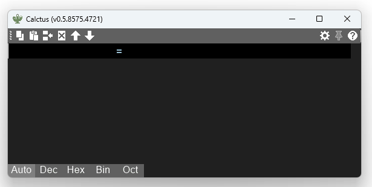
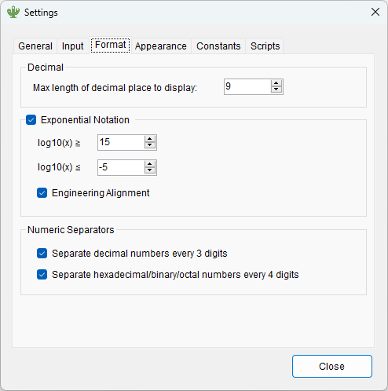
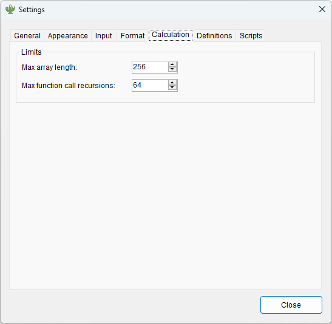
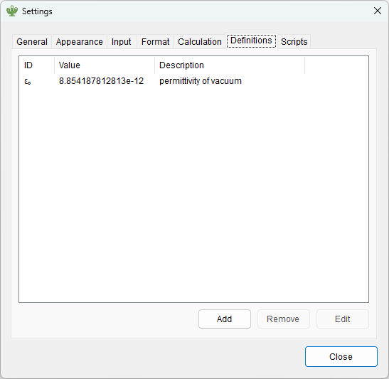

# Calctus

Calctus (カルクタス) is a calculator application for Windows developed for engineers.


----

## Download

→ See [releases](https://github.com/shapoco/calctus/releases).

----

## Overview

- Syntax highlighting and auto-completion.
- Decimal, hexadecimal, and binary numbers can be mixed.
- SI prefixes, datetime formats, RGB color representation and several other formats are also available.
- The formula history can be modified, and the calculation results are immediately regenerated.
- Built-in constants and built-in functions. Constants and functions can also be user-defined.
- Numerical solution of equations by Newton's method.

----

## Features

### Numeric Representations

|Representation|Example|
|:--|--:|
|Decimal|`123`|
|Hexadecimal|`0x7b`, `0x7B`|
|Octadecimal|`0173`|
|Binary|`0b1111011`|
|SI Prefixed|`123k`, `456u`|
|Binary Prefixed|`123ki`, `456Mi`|
|Fraction|`2$3`|
|Character|`'A'`|
|String|`"ABC"`|
|Date Time|`#2022/34/56 12:34:56#`|
|Web Color|`#123`, `#112233`|
|Boolean|`true`, `false`|
|Array|`[1, 2, 3]`|

### Operators

|Category|Symbol|Type|
|:--|:--|:--|
|Add, Sub, Mul, Div|`+`, `-`, `*`, `/`|`Decimal`|
|Integral Division|`//`|`Decimal`|
|Remainder|`%`|`Decimal`|
|Power|`^`|`Double`|
|Bit NOT|`~`|`Int64`|
|Bit AND|`&`|`Int64`|
|Bit OR|`\|`|`Int64`|
|XOR|`+\|`|`Int64`|
|Logical Shift|`<<`, `>>`|`Int64`|
|Arithmetic Shift|`<<<`, `>>>`|`Int64`|
|Bit/Part Select|`[ ]`, `[ : ]`|`Int64`|
|Compare|`>`, `>=`, `<`, `<=`, `==`, `!=`|`Decimal`|
|Logical NOT|`!`|`Boolean`|
|Logical AND|`&&`|`Boolean`|
|Logical OR|`\|\|`|`Boolean`|
|Conditional Operator|`? :`|`Boolean`|
|Range Operator|`..`, `..=`|`Array`|
|Arrow|`=>`|`Function`|

### Constants

|Symbol|Value|
|:--|--:|
|`PI`|`3.1415926535897932384626433833`|
|`E`|`2.7182818284590452353602874714`|
|`INT_MIN`|`-2,147,483,648`|
|`INT_MAX`|`2,147,483,647`|
|`UINT_MIN`|`0`|
|`UINT_MAX`|`4,294,967,295`|
|`LONG_MIN`|`-9,223,372,036,854,775,808`|
|`LONG_MAX`|`9,223,372,036,854,775,807`|
|`ULONG_MIN`|`0`|
|`ULONG_MAX`|`18,446,744,073,709,551,615`|
|`DECIMAL_MIN`|`-79,228,162,514,264,337,593,543,950,335`|
|`DECIMAL_MAX`|`79,228,162,514,264,337,593,543,950,335`|

User-defined constants can also be used. 

### Built-In Functions

See [Built-In Functions](FUNCTIONS.md) for details.

<!-- START_OF_BUILT_IN_FUNCTION_TABLE -->
Now Calctus has 151 built-in functions.

|Category|Functions|
|:--:|:--|
|Absolute/Sign|`abs(*x)`, `mag(x[]...)`, `sign(*x)`|
|Array|`aggregate(array,func)`, `all(array)`, `all(array,func)`, `any(array)`, `any(array,func)`, `concat(array0,array1)`, `contains(array,*val)`, `count(array,func)`, `except(array0,array1)`, `extend(array,func,count)`, `filter(array,func)`, `indexOf(array,*val)`, `intersect(array0,array1)`, `lastIndexOf(array,*val)`, `len(array)`, `map(array,func)`, `range(start,stop)`, `range(start,stop,step)`, `rangeInclusive(start,stop)`, `rangeInclusive(start,stop,step)`, `reverseArray(array)`, `sort(array)`, `sort(array,func)`, `union(array0,array1)`, `unique(array)`, `unique(array,func)`|
|Assertion|`assert(x)`|
|Bit/Byte Operation|`count1(*x)`, `pack(b,array[]...)`, `reverseBits(b,*x)`, `reverseBytes(b,*x)`, `rotateL(b,*x)`, `rotateL(b,n,*x)`, `rotateR(b,*x)`, `rotateR(b,n,*x)`, `swap2(*x)`, `swap4(*x)`, `swap8(*x)`, `swapNib(*x)`, `unpack(array,x)`, `unpack(b,n,x)`|
|Cast|`array(s)`, `rat(*x)`, `rat(*x,max)`, `real(*x)`, `str(array)`|
|Color|`hsl2rgb(h,s,l)`, `hsv2rgb(h,s,v)`, `pack565(x,y,z)`, `rgb(r,g,b)`, `rgb(*rgb)`, `rgb2hsl(*rgb)`, `rgb2hsv(*rgb)`, `rgb2yuv(r,g,b)`, `rgb2yuv(*rgb)`, `rgbFrom565(*rgb)`, `rgbTo565(*rgb)`, `unpack565(*x)`, `yuv2rgb(y,u,v)`, `yuv2rgb(*yuv)`|
|Date Time|`fromDays(*x)`, `fromHours(*x)`, `fromMinutes(*x)`, `fromSeconds(*x)`, `now()`, `toDays(*x)`, `toHours(*x)`, `toMinutes(*x)`, `toSeconds(*x)`|
|Encoding|`base64Dec(str)`, `base64DecBytes(str)`, `base64Enc(str)`, `base64EncBytes(bytes[]...)`, `urlDec(str)`, `urlEnc(str)`, `utf8Dec(bytes[]...)`, `utf8Enc(str)`|
|E Series|`esCeil(series,*x)`, `esFloor(series,*x)`, `esRatio(series,*x)`, `esRound(series,*x)`|
|Exponential|`clog10(*x)`, `clog2(*x)`, `exp(*x)`, `log(*x)`, `log10(*x)`, `log2(*x)`, `pow(*x,y)`, `sqrt(*x)`|
|Gcd/Lcm|`gcd(array...)`, `lcm(array...)`|
|Gray Code|`fromGray(*x)`, `toGray(*x)`|
|Min/Max|`max(array...)`, `min(array...)`|
|Parity/Ecc|`eccDec(b,ecc,x)`, `eccEnc(b,*x)`, `eccWidth(*b)`, `oddParity(*x)`, `xorReduce(*x)`|
|Plotting|`plot(func)`|
|Prime Number|`isPrime(*x)`, `prime(*x)`, `primeFact(*x)`|
|Random|`rand()`, `rand(min,max)`, `rand32()`, `rand64()`|
|Representaion|`bin(*x)`, `char(*x)`, `datetime(*x)`, `dec(*x)`, `hex(*x)`, `kibi(*x)`, `oct(*x)`, `si(*x)`|
|Rounding|`ceil(*x)`, `floor(*x)`, `round(*x)`, `trunc(*x)`|
|Solve|`solve(func)`, `solve(func,array)`, `solve(func,min,max)`|
|String|`endsWith(*s,key)`, `join(sep,array[]...)`, `replace(*s,old,new)`, `split(sep,s)`, `startsWith(*s,key)`, `toLower(*s)`, `toUpper(*s)`, `trim(*s)`, `trimEnd(*s)`, `trimStart(*s)`|
|Sum/Average|`ave(array...)`, `geoMean(array...)`, `harMean(array...)`, `invSum(array...)`, `sum(array...)`|
|Trigonometric|`acos(*x)`, `asin(*x)`, `atan(*x)`, `atan2(a,b)`, `cos(*x)`, `cosh(*x)`, `sin(*x)`, `sinh(*x)`, `tan(*x)`, `tanh(*x)`|
<!-- END_OF_BUILT_IN_FUNCTION_TABLE -->

### Variables

Variables can be assigned using the equal sign.

```c++
a = 2
b = 3
a * b // --> 6.
```

JavaScript-style multiple assignment is available.

```c++
[a,b,c]=[10,20,30]
a // --> 10
b // --> 20
c // --> 30
```

### User Defined Function 

User functions can be defined using the `def` keyword.

```c++
def f(x) = x^2
f(3) // --> 9.
```

### Lambda Function :new:

Rust-style lambda function is available.

```c++
f=(a,b)=>a*b
f(3,4) // --> 12.
```

If there is only one argument, the parentheses can be omitted

```c++
f=x=>x^2
f(3) // --> 9.
```

### Solve Function (Newton-Raphson method) 

Use the `solve` function to solve equations numerically by Newton's method.

```c++
def f(x)=x^2-2
solve(f) // --> [-1.414213562, 1.414213562].
solve(x=>x^2-2) // This gives the same result.
```

By default, the Newton's method is performed based on automatically generated initial values. Therefore, it may produce inaccurate results if the solution is concentrated in a small area or exists far from the origin.

In such cases, the 2nd argument can be given an initial value.

```c++
solve(sin,314) // --> 314.159265359.
```

That initial value can also be given as an array.

```c++
solve(sin,[-314,314]) // --> [-314.159265359, 314.159265359].
```

By providing the 2nd and 3rd arguments at the same time, a range of initial values can be specified. In this case, 101 values between these ranges are used as initial values.

```c++
solve(sin,-5,5) // --> [-3.141592654, 0, 3.141592654].
```

:warning: Note that the solution obtained using the `solve` function is an approximation and does not necessarily correspond to the analytical solution.

### Part-selection 

Verilog-style part selection is available for arrays and scalar values.

```c++
array=[1,2,3]
array[1]   // --> 2.
array[1]=5 // --> [1, 5, 3].
```

```c++
x=0x1234
x[11:4]      // --> 0x23.
x[11:4]=0xab
x            // --> 0x1ab4.
```

Negative indexes represents distance from the end of the array. :new:

```c++
array=[1,2,3,4,5]
array[-2]    // --> 4.
array[-3:-1] // --> [3, 4, 5].
```

### Range operator and range function :new:

Rust-style range operators can be used to generate sequences of numbers.

```c++
1..5  // --> [1, 2, 3, 4]
1..=5 // --> [1, 2, 3, 4, 5]
```

Python-style range functions can also be used.

```c++
range(1,5)              // --> [1, 2, 3, 4]
range(1,5,0.5)          // --> [1, 1.5, 2, 2.5, 3, 3.5, 4, 4.5]
rangeInclusive(1,5)     // --> [1, 2, 3, 4, 5]
rangeInclusive(1,5,0.5) // --> [1, 1.5, 2, 2.5, 3, 3.5, 4, 4.5, 5]
```

### Vectorization :new:

Many unary and binary operators can be applied to arrays to perform operations on its individual elements.

```
-[1,2,3]        // --> [-1, -2, -3]
[1,2,3]*4       // --> [4, 8, 12]
[1,2,3]+[4,5,6] // --> [5, 7, 9]
```

Also functions with arguments marked with an asterisk can be vectorized by supplying an array for the argument.

For example, the power function `pow(*x, y)` can take an array as its `x` argument. `pow([1,2,3],3)` is equivalent to `[pow(1,3),pow(2,3),pow(3,3)]`.

```
pow(2,3)        // --> 8
pow([1,2,3],3)  // --> [1, 8, 27]
prime(0..5)     // --> [2, 3, 5, 7, 11]
```

### Omission of Opening Parentheses 

The opening parenthesis at the beginning of a line can be omitted.

```c++
1+2)*3 // --> 9
```

### Auto-Completion


### Exponent Adjustment

Exponent-part of E-notation and SI prefix can be adjusted using Alt + arrow keys.



### Assertion


### RPN Operations

If only an operator is entered, the expression is "popped" from the history and combined with that operator.

If you use RPN operation, it is recommended to turn off the automatic input of "ans" in the settings.

```c++
1 [Return]
2 [Return]
+ [Return] // --> "1" and "2" replaced with "1+2"
3 [Return]
4 [Return]
+* [Return] // --> "1+2", "3" and "4" replaced with "(1+2)*(3+4)"
```


### External Script Call as Functions

Calctus can call scripts such as Python as functions.

Function arguments are passed to the script as command line arguments, and the standard output of the script is returned to Calctus.

1. Open the `Scripts` tab in the Calctus Settings dialog.
2. Check `Enable External Script Functions`.
3. If you want to specify the folder where you want to place the scripts, click the `Change` button to specify the folder.
4. Click the `Open` button. If asked if you want to create the folder, click `Yes`.
5. Place a python script `add.py` like the following in the folder.
    ```python
    import sys
    a = float(sys.argv[1])
    b = float(sys.argv[2])
    print(a + b)
    ```
6. After closing the settings dialog, the `add` function is now available.

If you wish to use a scripting language other than Python, please register the extension and interpreter in the `Scripts` tab of the Settings dialog.

### Graph Plotting

`plot(func)` can be used to draw a graph. `func` is a function that takes one argument. The value of the argument is plotted on the horizontal axis and the return value of the function on the vertical axis.

:warning: This feature is experimental and may be removed in future versions.


### Keyboard Shortcut

|Key|Function|
|:--|:--|
|`Shift` + `Return`|Insert a new line before current expression|
|`Shift` + `Delete`|Delete current expression|
|`Ctrl` + `S`|Overwrite current sheet|
|`Ctrl` + `Z`|Undo|
|`Ctrl` + `Y`|Redo|
|`Ctrl` + `X`|Cut|
|`Ctrl` + `C`|Copy|
|`Ctrl` + `Shift` + `C`|Copy all expressions and answers|
|`Ctrl` + `V`|Paste (accepts multiple lines)|
|`Ctrl` + `Shift` + `V`|Paste with formatting|
|`Ctrl` + `Shift` + `N`|Insert current time|
|`Ctrl` + `Shift` + `Del`|Delete all expressions|
|`Ctrl` + `Shift` + `Up`/`Down`|Item move up/down|
|`Alt` ( + `Shift` ) + `Left`/`Right`|Move decimal point|
|`Alt` + `Up`/`Down`|Change SI prefix|
|`F1`|Help|
|`F5`|Recalculation|
|`F8`|Radix Mode = Auto|
|`F9`|Radix Mode = Dec|
|`F10`|Radix Mode = Hex|
|`F11`|Radix Mode = Bin|
|`F12`|Radix Mode = SI Prefixed|

----

## Settings









----
