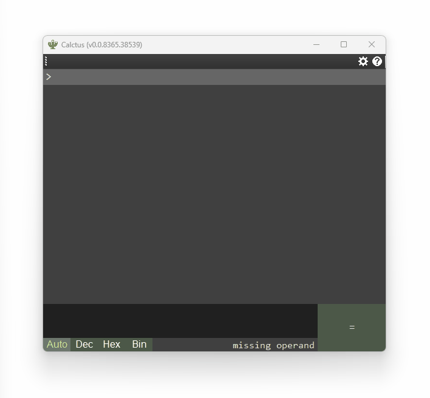

# Calctus

a calculator for Windows.



## Download

→ see [releases](https://github.com/shapoco/calctus/releases).

## Overview

- Displays the evaluation value of a formula in text format.
- Decimal, hexadecimal, and binary numbers can be mixed.
- The formula history can be referenced with the up key.
- The formula history can be modified, and if so, the calculation results are regenerated.
- Some built-in constants and built-in functions.

## Features

### Numeric Representations

|Description|Example|
|:--|--:|
|Decimal|`123`|
|Hexadecimal|`0x7b`, `0x7B`|
|Octadecimal|`0173`|
|Binary|`0b1`|

### Operators

|Category|Symbol|
|:--|:--|
|Add, Sub, Mul, Div|`+`, `-`, `*`, `/`|
|Integral Division|`//`|
|Remainder|`%`|
|Power|`^`|
|Logical NOT|`~`|
|Logical AND|`&`|
|Logical OR|`\|`|
|Logical XOR|`+\|`|
|Logical shift|`<<`, `>>`|
|Arithmetic shift|`<<<`, `>>>`|


### Embedded Functions

|Category|Functions|
|:--|:--|
|Exponential|`sqrt(x)`, `log(x)`, `log2(x)`, `log10(x)`, `clog2(x)`, `clog10(x)`|
|Trigonometric|`sin(x)`, `cos(x)`, `tan(x)`, `asin(x)`, `acos(x)`, `atan(x)`, `atan2(y, x)`|
|Round|`floor(x)`, `ceil(x)`, `trunc(x)`, `round(x)`|
|Others|`sign(x)`|

### Constants

|Symbol|Value|
|:--|--:|
|`PI`|`3.1415926535897931`|
|`E`|`2.7182818284590451`|
|`INT_MIN`|`-2147483648`|
|`INT_MAX`|`2147483647`|
|`UINT_MIN`|`0`|
|`UINT_MAX`|`4294967295`|
|`FLOAT_MIN`|`-3.40282347E+38f`|
|`FLOAT_MAX`|`3.40282347E+38f`|
|`DOUBLE_MIN`|`-1.7976931348623157E+308`|
|`DOUBLE_MAX`|`1.7976931348623157E+308`|

### Variables

Variables can be assigned using the equal sign.

```
a = 2 [Return]
b = 3 [Return]
a * b [Return]
// --> Calctus answers 6.
```

### Keyboard Shortcut

|Key|Function|
|:--|:--|
|`Shift` + `Return`|Insert|
|`Shift` + `Delete` :new:|Delete current expression|
|`Ctrl` + `Shift` + `C` :new:|Copy all expressions and answers|
|`Ctrl` + `Shift` + `Del` :new:|Delete all expressions|
|`F9` :new:|Radix Mode = Auto|
|`F10` :new:|Radix Mode = Dec|
|`F11` :new:|Radix Mode = Hex|
|`F12` :new:|Radix Mode = Bin|

----
